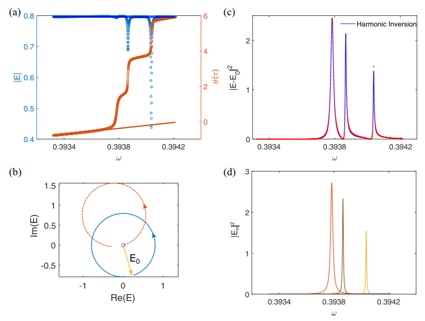

# Dynamics of transmission in disordered topological insulators

Robust transmission in topological insulators makes it possible to steer waves without attenuation along bent
paths within imperfectly fabricated photonic devices. But the absence of reflection does not guarantee the fidelity
of pulsed transmission which is essential for core photonic functionalities. Pulse transmission is disrupted by
localized modes in the bulk of topological insulators which coexist with the continuum edge mode and are
pushed deeper into the band gap with increasing disorder. Here we show in simulations of the Haldane model
that pulse propagation in disordered topological insulators is robust throughout the central portion of the band
gap where localized modes do not arise. Since transmission is robust in topological insulators, the essential field
variable is the phase of the transmitted field, or, equivalently, its spectral derivative, which is the transmission
time. Except near resonances with bulk localized modes that couple the upper and lower edges of a topological
insulator, the transmission time in a topological insulator is proportional to the density of states and to the
energy excited within the sample. The variance of the transmission time at the band edge for a random ensemble
with moderate disorder is dominated by fluctuations at resonances with localized states, and initially scales
quadratically

## Speckle pattern


We calculate the time delay of a disordered topological insulator confined as quasi-one-dimensional
strip based on the tight-binding model. Two approaches, the field decomposition and time delay decomposition, are
tested to extract the complex energy of the discrete modes in the presence of the edge mode. The previous
discussion of time delay and DOS are mainly based on the scattering matrix, we show here that the spatial matrix of
Green’s function between the output and input can be directly used to calculate the DOS. This facilitates the
calculation of DOS because it is easier to obtain the Green’s function, in measurements and numerical simulation
such as recursive Green’s function method. When modal overlap is small, the transmitted field can be decomposed
into a superposition of discrete modes and the edge channel. This decomposition is possible even though
transmission is dominated by robust transmission in the edge state. When the upper edge mode is not coupled to the
lower edge mode via disorder, the eigenchannel time delay is then equivalent to the integral of intensity inside the
sample, whose spectrum can be decomposed into a superposition of Lorentzian lines.

## Phase variation



The increase of phase
by 2π when tuning through a resonance in a disordered TI, 
contrasts with the increase of π
in a trivial random medium. The phase change of 2π can
be understood from the complex representation of the field
in which the curve of the complex field
encircles the original point in the presence of the continuum.

## Cite this Work:
If you find this  work useful, you may cite this work:
```
Kang, Y., Huang, Y. & Genack, A. Z. Dynamics of transmission in disordered topological insulators. Physical Review A 103, 033507 (2021)

```

